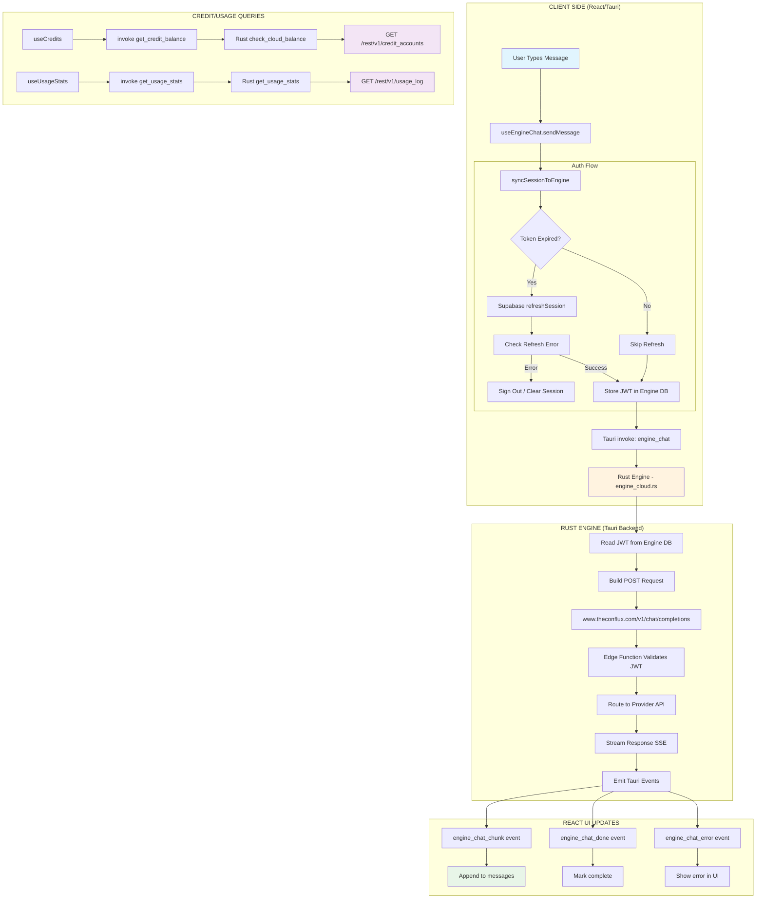
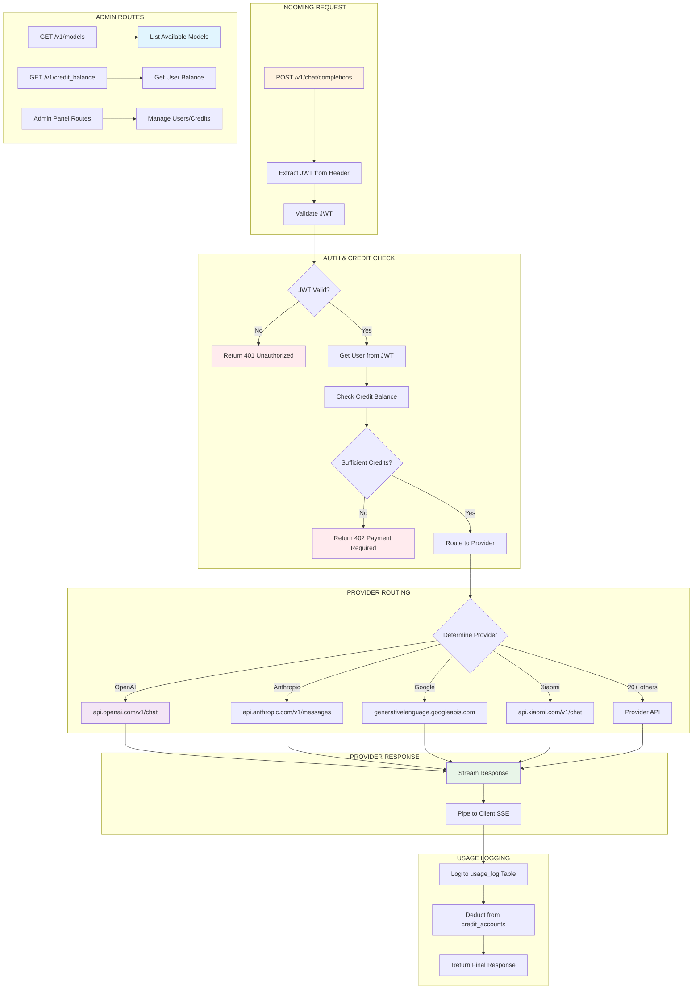

# Conflux Architecture Diagrams

> Visual debugging map for Conflux Home + Conflux Router systems

---

## System 1: Conflux Home (Desktop App)

---

## System 2: Conflux Router (Cloud Edge Function)

---

## VERIFICATION CHECKLIST

### Conflux Home - Client Side

| # | Step | File(s) | How to Verify | Status |
|---|------|---------|---------------|--------|
| H1 | App loads, useAuth runs | `src/hooks/useAuth.ts` | Console: `[useAuth] Session refreshed successfully` | ☐ |
| H2 | Supabase session syncs to Rust | `src/hooks/useAuth.ts` (line ~103) | Console: `[syncSessionToEngine] Syncing token: eyJ...` | ☐ |
| H3 | Credits load on mount | `src/hooks/useCredits.ts` | `balance` prop not null, no errors | ☐ |
| H4 | Usage stats load | `src/hooks/useCredits.ts` | `stats` prop not null, no errors | ☐ |
| H5 | User types message | `src/hooks/useEngineChat.ts` | Text input accepts typed text | ☐ |
| H6 | syncSessionToEngine called pre-chat | `src/hooks/useEngineChat.ts` (line ~275) | Console: `[useEngineChat] Syncing session before chat...` | ☐ |
| H7 | Token refresh if <60s remaining | `src/lib/syncSession.ts` | Console: `Token expiring soon, refreshing...` (if applicable) | ☐ |
| H8 | Tauri engine_chat invoked | `src/hooks/useEngineChat.ts` | `invoke("engine_chat", ...)` call completes | ☐ |

### Conflux Home - Rust Engine

| # | Step | File(s) | How to Verify | Status |
|---|------|---------|---------------|--------|
| R1 | set_supabase_session stores token | `src-tauri/src/commands.rs` | Token exists in engine DB | ☐ |
| R2 | engine_chat reads JWT from DB | `src-tauri/src/engine/cloud.rs` | Logs show JWT read | ☐ |
| R3 | Request built with correct URL | `src-tauri/src/engine/cloud.rs` | URL = `https://www.theconflux.com/v1/chat/completions` | ☐ |
| R4 | Authorization header set | `src-tauri/src/engine/cloud.rs` | Header: `Authorization: Bearer {JWT}` | ☐ |
| R5 | Response streams as SSE | `src-tauri/src/engine/cloud.rs` | Tauri event `engine_chat_chunk` fires | ☐ |
| R6 | Done event fires on complete | `src-tauri/src/engine/cloud.rs` | Tauri event `engine_chat_done` fires | ☐ |
| R7 | Error handling | `src-tauri/src/engine/cloud.rs` | Tauri event `engine_chat_error` fires on failure | ☐ |

### Conflux Router - Edge Function

| # | Step | File(s) | How to Verify | Status |
|---|------|---------|---------------|--------|
| RT1 | Request arrives at /v1/chat/completions | `supabase/functions/conflux-router/index.ts` | Edge function logs | ☐ |
| RT2 | JWT validation (anon key) | `supabase/functions/conflux-router/index.ts` | Returns user data on valid JWT | ☐ |
| RT3 | Credit check query | `supabase/functions/conflux-router/index.ts` | Query: `credit_accounts?user_id=eq.{id}` | ☐ |
| RT4 | Provider routing logic | `supabase/functions/conflux-router/index.ts` | Correct provider selected for model | ☐ |
| RT5 | Provider API call | `supabase/functions/conflux-router/index.ts` | Request sent to provider | ☐ |
| RT6 | Stream response back | `supabase/functions/conflux-router/index.ts` | SSE stream to client | ☐ |
| RT7 | Log usage to DB | `supabase/functions/conflux-router/index.ts` | Insert into `usage_log` table | ☐ |
| RT8 | Deduct credits | `supabase/functions/conflux-router/index.ts` | Update `credit_accounts` table | ☐ |

### Database / Supabase

| # | Step | Table/View | How to Verify | Status |
|---|------|------------|---------------|--------|
| DB1 | User exists (donziglioni) | `auth.users` | `SELECT * FROM auth.users WHERE email = 'donziglioni@gmail.com'` | ☐ |
| DB2 | Credit account exists | `credit_accounts` | `SELECT * FROM credit_accounts WHERE user_id = '{id}'` | ☐ |
| DB3 | Usage log entries created | `usage_log` | `SELECT * FROM usage_log WHERE user_id = '{id}' ORDER BY created_at DESC LIMIT 5` | ☐ |
| DB4 | JWT still valid | (browser storage) | Check `expires_at` > current time | ☐ |

---

## How to Use This Diagram

1. **View in VS Code**: Install "Markdown Preview Mermaid Support" extension
2. **View in GitHub**: The diagrams render automatically when viewing ARCHITECTURE.md
3. **View in Obsidian**: Native Mermaid support enabled
4. **Debug path**: Start at top of each diagram, follow arrows, verify each checkpoint

---

## Common Error Signatures

| Error | Likely Cause | Fix Location |
|-------|--------------|--------------|
| `401 Unauthorized: Empty JWT` | Token not synced to engine | `src/hooks/useAuth.ts` line ~103 |
| `401 Unauthorized: Invalid/expired` | Token expired, not refreshed | `src/lib/syncSession.ts` |
| `400 Bad Request: timestamp` | `+` in URL not encoded | `src-tauri/src/engine/cloud.rs` line ~765 |
| `429 Too Many Requests` | `refreshSession()` called too many times | `syncSessionToEngine` cooldown logic |
| `307 CORS redirect denied` | Using `theconflux.com` instead of `www.theconflux.com` | `CLOUD_ROUTER_URL` env var |
| `undefined is not an object (modelStats.credits)` | TS/Rust field name mismatch | `useCredits.ts` interface, render code |

---

*Last updated: 2026-04-02*
